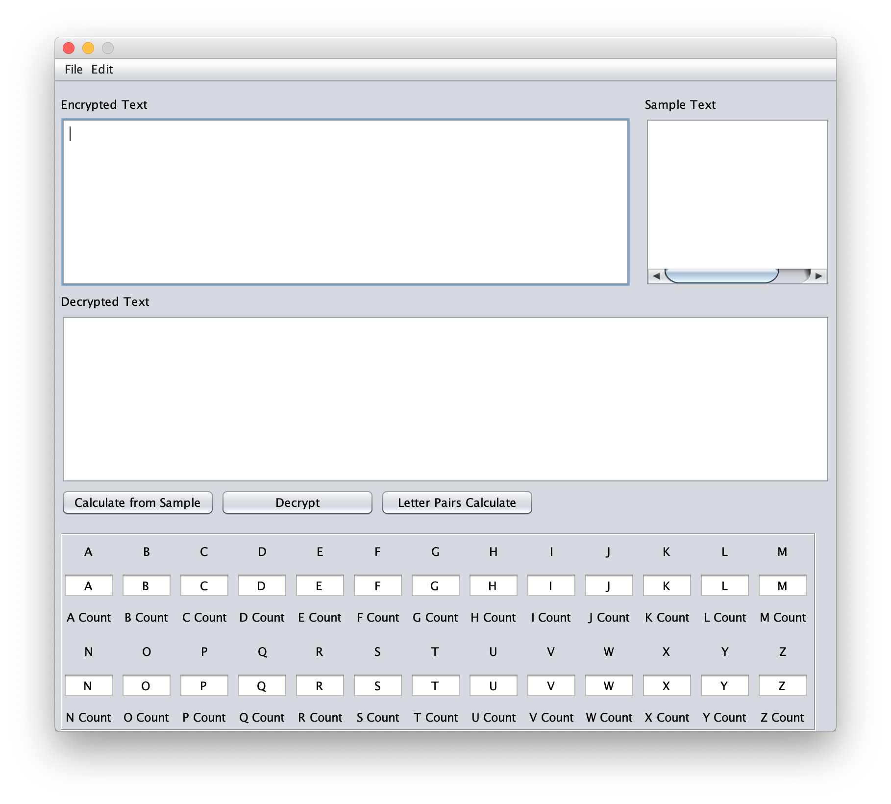

# CryptoAnalysis_CS3350

This is a MonoAlphabetic Substitution Decrypt Tool made for Foundations of Computer Security CS3350 at Cedarville University
Created by Luke Giannoutsos and Nathan O'Neel.

## Using The Tool
This tool was created with NetBeans (https://netbeans.org/) and uses the JFrame library.

To run open the CryptoAnalysis project in NetBeans. Click on CryptoAnalysis in the projet menu and run.

Next, paste in sample text to the "Sample Text" box and click "Calculate from Sample" to set a baseline for the letter freqency.

Then you can Decrypt and change individual letters and it will reflect in the "Decrypted Text" box.
